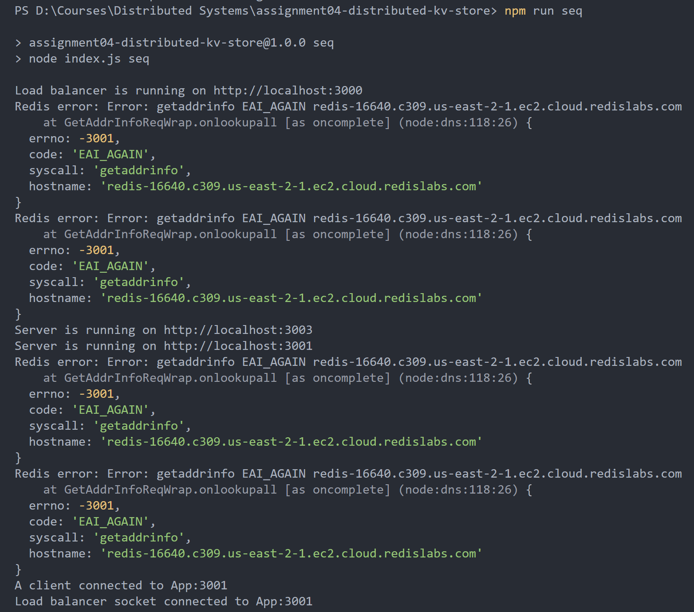
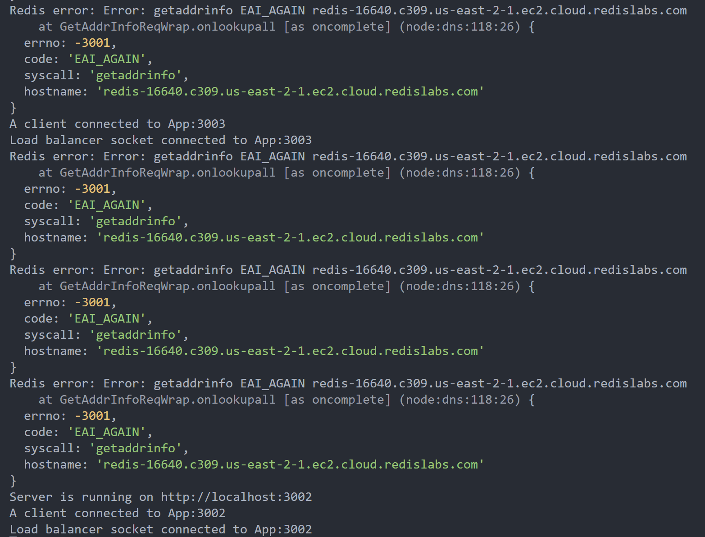
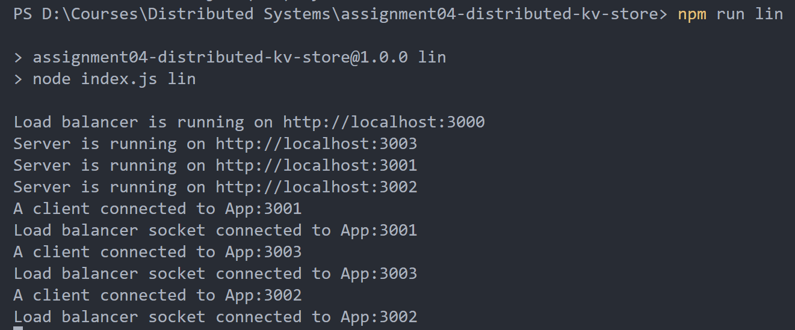

## 1. Prerequisites

- Node.js: Ensure that Node.js is installed on your system. You can download the LTS from [https://nodejs.org/en](https://nodejs.org/en)

- npm Packages: Open a terminal and navigate to the project directory. Run the following command to install the required npm packages.

  ```js
  npm install
  ```

## 2. Using the Application

1. First the start the total-order-multicast server. Open a terminal and navigate to the project directory. Run the following command:

   ```js
    npm run tom-server
   ```

2. Lets start the load balancer and create replicas. Open a new terminal and navigate to the project directory. Run either of the commands as per your need:

   For running the app in sequential mode:

   ```js
   npm run seq
   ```

   For running the app in linearizable mode:

   ```js
   npm run lin
   ```

   For running the app in eventual mode:

   ```js
   npm run eve
   ```

3. To run the testcases, open a new terminal and navigate to the project directory. Run either of the commands as per your need:

   Make sure the app is running in sequential mode:

   ```js
   npm run seq-test
   ```

   Make sure the app is running in linearizable mode:

   ```js
   npm run lin-test
   ```

   Make sure the app is running in eventual mode:

   ```js
   npm run eve-test
   ```

4. If you want to make your own requests please refer to `test.js` file under desired consistency folder. The SET/GET requests will be either supporting a socket event or a REST API call.

**NOTE:** The application will initially try to connect to redis kv stores, they may initially throw an error connecting but they will get connected after several retries, please wait until then. This is because the redis is on cloud and due the free version sometimes the server goes idle and may take time to start.

For example:




They may not throw error as well:


