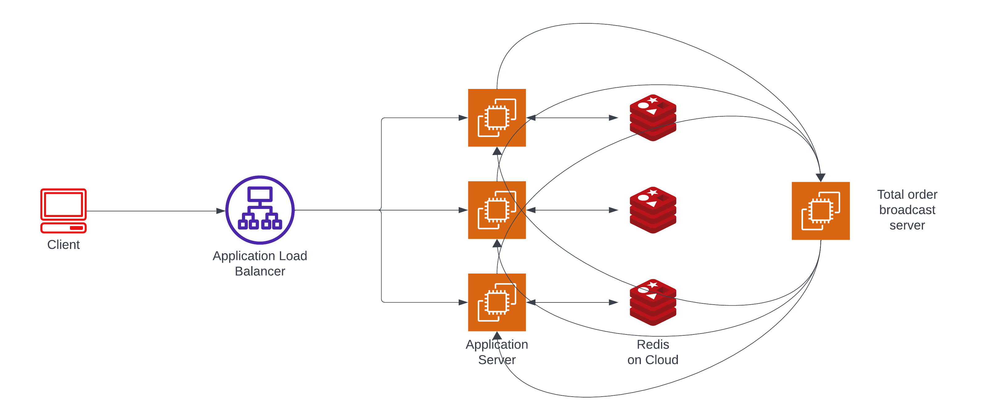

## Implementation



1. Request from any client first reaches application load balancer which works on round robin principle which rotates connection requests among web servers in the order that requests are received.
2. Each application/replica is connected to its own redis key-value store and can handle SET / GET requests forwarded by the load balancer.
3. Every application/replica is connected to a central total-order-multicast server. An application can emit a broadcast message event to a tom server, then the tom server broadcasts this message to all its connected clients. And the clients which connected to tom server are our replicas itself.

### Sequential:

#### GET:

1. Find the detailed code under `/sequential/app.js`
2. Implemented as a REST API endpoint, reads the key from its own redis kvstore and immediately returns the value.

```js
app.get("/api/get/:key", async (req, res) => {
  /*
    Query the redis kvstore with key and sends back the value to the load balancer which in turn sends back to client.
  */
});
```

#### SET:

1. Find the detailed code under `/sequential/app.js`
2. This works on sockets as we cannot send the response immediately, it places a broadcast request to the tom server.
3. `handleWrite` is executed when the tom controller sends the message to the application. If the current server is the initiator of this message then the response is sent back to the load balancer which in turn sends back to client.

```js
async function handleWrite(data) {
  /*
  write in the local redis key value store
  */

  if (initiator == PORT) {
    io.emit("set-response", { ...data, message });
  }
}

socket.on("set", (data) => {
  console.log(`SET recieved from load balancer on App:${PORT}`);
  tom.broadcast({
    event: "set",
    key: data.key,
    value: data.value,
    userId: data.userId,
    initiator: PORT,
  });
});
```

### Linearizable:

#### GET:

1. Find the detailed code under `/linearizable/app.js`
2. This works on sockets as we cannot send the response immediately, it places a broadcast request to the tom server.
3. `handleRead` is executed when the tom controller sends the message to the application. If the current server is the initiator of this message then the response is sent back to the load balancer which in turn sends back to client.

```js
async function handleRead(data) {
  /*
  read from the local redis key value store
  */

  if (initiator == PORT) {
    io.emit("get-response", { ...data, value, message });
  }
}

socket.on("get", (data) => {
  console.log(`GET recieved from load balancer on App:${PORT}`);
  tom.broadcast({
    event: "get",
    key: data.key,
    userId: data.userId,
    initiator: PORT,
  });
});
```

#### SET:

1. Find the detailed code under `/linearizable/app.js`
2. This works same as explained in sequential SET.

### Eventual:

#### GET:

1. Find the detailed code under `/eventual/app.js`
2. This works same as explained in sequential GET.

#### SET:

1. Find the detailed code under `/eventual/app.js`
2. Implemented as a REST API endpoint, writes the key value pair to its own redis kvstore and immediately returns the response.
3. After the response is returned it places a broadcast request to the tom server. This is done to ensure that there are no conflicting updates across the replicas.
4. For example instead of total-order-broadcast if we used a simple update request. Let say `replica-1` updates to `(k1, v1)` and sends `update(k1, v1)` to `replica-2` and similarly `replica-2` updates to `(k2, v2)` and sends `update(k2, v2)` to `replica-1`. Therefore, `replica-1` ends with `(k2, v2)` and `replica-2` with `(k1, v1)`. Hence to avoid this conflict we use total order broadcast and we dont wait for the broadcast process to complete as we only need eventual consistency.

```js
app.post("/api/set", async (req, res) => {
  const { key, value } = req.body;
  const result = await handleWrite(req.body);
  tom.broadcast({
    event: "set",
    key,
    value,
  });

  res.status(200).json({
    message: result.message,
    performedBy: `Request performed by App:${PORT}`,
  });
});
```

## Testcase Interpretation:

### Sequential:


There are 5 users/clients running parallely, the test suite makes multiple requests and records the responses receieved for each client.

**User-1:**

1. Makes a SET request to replica `3001` with `key = name` and `value = batman`
2. Makes a GET request to replica `3002` with `key = name`, even before the SET response is received.
3. We immediately received a response with `value = null`. From this we can understand that the SET request we made earlier still did not reach the replica `3002`.
4. Next we received the success response for the SET request made earlier.

**User-2:**

1. Makes a SET request to replica `3001` with `key = name` and `value = superman`
2. Makes a GET request to replica `3002` with `key = name`, even before the SET response is received.
3. We immediately received a response with `value = null`. From this we can understand that the SET request we made earlier still did not reach the replica `3002`.
4. Next we received the success response for the SET request made earlier.

**User-3:**

1. Makes 5 continuous GET requests to replica `3001`. Each request is made with a gap of 600 ms.
2. Initially the first two requests returned `null`. This means the GET request is too fast that none of the SET requests from other users still did not complete yet.
3. The third request returned `value = superman`. This means the SET request from user2 could have happened before SET request from user1.
4. The fourth request returned `value = batman`. This means the SET request from user1 reached the application.
5. The fifth request returned `value = batman`. This is expected because `batman` was the last value we set.
6. We can see that user1 and user2 were concurrent. user1 sent `superman` and user2 sent `batman`. there could be any order `set(name, superman)` followed by `set(name, batman)` or viceversa. This order is decided by our total order broadcast protocol.

**User-4 and User-5:**

1. user4 and user5 makes 5 continuous GET requests to replica `3002` and `3003` with a gap of 600 ms respectively.
2. We can clearly observe the values transitioning from `null` to `superman` to `batman` simillar to that we have seen in user3. Hence total order is ensured at each replica as the order of operations are same.

### Linearizable:


1. Following are the requests sent. All the requests are sent immediately without waiting for any of their responses. The recorded responses are observed in the above image.

   `get(fruit)` to replica `3001`
   `set(fruit, apple)` to replica `3001` with a delay of 10ms
   `set(fruit, mango)` to replica `3002`
   `set(fruit, banana)` to replica `3003`
   `get(fruit)` at replica `3001`
   `get(fruit)` at replica `3001` with delay of 20ms

2. We can interpret the following order of requests performed from the responses receieved: `get(fruit)`, `set(fruit, mango)`, `set(fruit, banana)`, `get(fruit)`, `set(fruit, apple)` and `get(fruit)`.
3. Talking about the last but one `get(fruit)` which returned `banana`. `banana` was set at replica `3003` after it completed the broadcasts at all other replicas then only the current `get(fruit)` was performed at replica `3001`, this shows that all set/get operations follow the total-order, hence we received the changed fruit value.
4. The last `get(fruit)` returned `apple`. we can see that `set(fruit, apple)` was the last set operation because it had a delay of 10ms, and `get(fruit)` had a delay of 20ms therefore, we receieved `apple`.

### Eventual:


**User-1**:

1. Makes a SET request to replica `3001` with `key = vehicle and value = bike.`
2. We immediately recieve a successful response from `3001`. And internally the replicas become eventually consistent.

**User-2**:

1. Makes a SET request to replica `3002` with `key = vehicle` and `value = car`.
2. We immediately recieve a successful response from `3002`. And internally the replicas become eventually consistent.

**User-3**:

1. Makes 5 continuous GET requests to replica `3001`. Each request is made with a gap of 500 ms.
2. The first four requests returned `bike` and last request returned `car`.
3. We can assume that due to user1 the value became bike at `3001` and eventually value becomes `car` so that all the replicas are consistent with same value `car`. We will see the other user responses to confirm this.

**User-4**:

1. Makes 5 continuous GET requests to replica `3002`. Each request is made with a gap of 500 ms.
2. The first three requests returned `car` and the 4th request returned `bike` then the 5th request returned `car`.
3. We can assume that due to user2 the value became `car` at `3002` and eventually due to broadcast from user1 it became `bike` and then due to broadcast from itself it ends up with value `car`.

**User-5**:

1. Makes 5 continuous GET requests to replica `3003`. Each request is made with a gap of 500 ms.
2. The first three requests returned `null` and the 4th request returned `bike` then the 5th request returned `car`.
3. As there were no local requests to `3003` the initial values are `null` (stale). Eventually due to the broadcasted messages from user1 and user2 the value changed to `bike` and then `car` respectively.

We can clearly see that all the replicas eventually converge to a consistent value `bike`.
